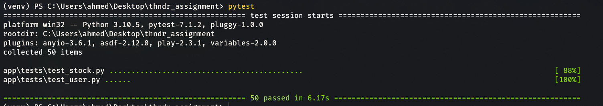

# Stock API With FastAPI and VerneMQ

- Documentation available at /docs

## Run

```bash
docker-compose up -d
```

## Testing

- install requirements then run

```bash
pytest

```

### Test Results


